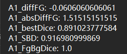
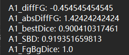
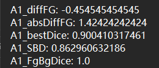
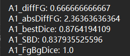

# Learning to Model Pixel-Embedded Affinity for Homogeneous Instance Segmentation

**Accepted by AAAI-2022**


Wei Huang, Shiyu Deng, Chang Chen, Xueyang Fu, Zhiwei Xiong(*)

*Corresponding Author

University of Science and Technology of China (USTC)


## Introduction

This repository is the **official implementation** of the paper, "Learning to Model Pixel-Embedded Affinity for Homogeneous Instance Segmentation", where more implementation details are presented.


## Installation

This code was tested with Pytorch 1.0.1 (later versions may work), CUDA 9.0, Python 3.7.4 and Ubuntu 16.04. It is worth mentioning that, besides some commonly used image processing packages, you also need to install some special post-processing packages for neuron segmentation, such as [waterz](https://github.com/funkey/waterz) and [elf](https://github.com/constantinpape/elf).

If you have a [Docker](https://www.docker.com/) environment, we strongly recommend you to pull our image as follows,

```shell
docker pull registry.cn-hangzhou.aliyuncs.com/renwu527/auto-emseg:v5.4
```

or

```shell
docker pull renwu527/auto-emseg:v5.4
```


## Dataset

| Datasets                                                     | Training set | Validation set | Test set      | Download (Processed)                                         |
| ------------------------------------------------------------ | ------------ | -------------- | ------------- | ------------------------------------------------------------ |
| [CVPPP (A1)](https://competitions.codalab.org/competitions/18405) | 530x500x108  | 530x500x20     | 530x500x33    | [BaiduYun](https://pan.baidu.com/s/1fH5ek1Zy5pz5R0HQfaUbTg) (Access code: weih) or [GoogleDrive](https://drive.google.com/drive/folders/1IsPmaBjDXkSyzPXKjB4GIwHb_5pVVXBe?usp=sharing) |
| [BBBC039V1](https://bbbc.broadinstitute.org/BBBC039)         | 520x696x100  | 520x696x50     | 520x696x50    | [BaiduYun](https://pan.baidu.com/s/1S2tYjfN4-mMIRgnxfY8QsQ) (Access code: weih) or [GoogleDrive](https://drive.google.com/drive/folders/1IsPmaBjDXkSyzPXKjB4GIwHb_5pVVXBe?usp=sharing) |
| [AC3/AC4](https://software.rc.fas.harvard.edu/lichtman/vast/<br/>AC3AC4Package.zip) | 1024x1024x80 | 1024x1024x20   | 1024x1024x100 | [BaiduYun](https://pan.baidu.com/s/1rY6MlALpzvkYTgn04qghjQ) (Access code: weih) or [GoogleDrive](https://drive.google.com/drive/folders/1IsPmaBjDXkSyzPXKjB4GIwHb_5pVVXBe?usp=sharing) |

Download and unzip them in corresponding folders in './data'.


## CVPPP

```she
cd ./scripts_cvppp
```

### 0. Install metrics for CVPPP

```she
cd ./lib/evaluate
python setup.py build_ext --inplace
cd ../..
```

### 1. Training

```shell
python main.py -c=cvppp
```

### 2. Inference

```shell
python inference.py -c=cvppp -mn=cvppp -id=cvppp-validation -m=validation
```


## BBBC039V1

```shell
cd ./scripts_bbbc039v1
```

### 1. Training

```shell
python main.py -c=bbbc039v1
```

### 2. Inference

```shell
python inference.py -c=bbbc039v1 -mn=bbbc039v1 -id=bbbc039v1-test -m=test
```


## AC3/AC4

```shell
cd ./scripts_ac3ac4
pip install waterz
```

### 1. Training

```shell
python main.py -c=ac3ac4
```

### 2. Inference

```shell
python inference.py -c=ac3ac4 -mn=ac3ac4 -id=ac3ac4-test -m=ac3
```


## Notice for CVPPP

During the training phase, we use the SBD metric (./scripts_cvppp/utils/evaluate.py/SymmetricBestDice) to select models.

In our paper, we provide the [SBD score](https://competitions.codalab.org/competitions/18405#learn_the_details-evaluation) and the absDiffFG score returned by the website as follows.

| ResNet-50                      | ResNet-101                      | ResUNet                       |
| ------------------------------ | ------------------------------- | ----------------------------- |
|  |  |  |

**However, we have noticed that the website made adjustments to the SBD metric at the end of 2021.**

Therefore, we submit our previous results again (05/02/2022), and obtain the new return scores as follows.

| ResNet-50                      | ResNet-101                      | ResUNet                       |
| ------------------------------ | ------------------------------- | ----------------------------- |
|  |  |  |

We can find that the new SBD scores are significantly lower than the previous scores.


## Contact

If you have any problem with the released code, please do not hesitate to contact me by email (weih527@mail.ustc.edu.cn).

